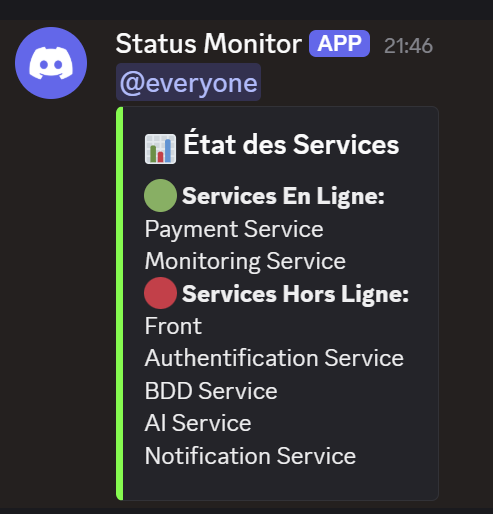

# Monitoring Service

Ce service surveille l’état de tous les microservices de ton architecture et envoie des alertes en temps réel sur un salon Discord via un webhook.

## 🚦 Fonctionnalités principales

- **Vérification automatique** de l’état de chaque service via leur route `/health`
- **Alertes Discord** en cas de changement de statut (service en ligne/hors ligne)
- **Récapitulatif visuel** de l’état de tous les services dans un message Discord
- **Logs** des statuts pour l’historique

## 📸 Exemple de résultat

Voici un exemple de message envoyé par le bot Discord lorsque certains services sont hors ligne :



> **Remarque :**  
> L’image ci-dessus montre le message envoyé par le bot avec la liste des services en ligne et hors ligne, pour une visibilité immédiate de l’état de l’infrastructure.

## ⚙️ Configuration

1. **Variables d’environnement à définir dans `.env` :**
    ```env
    FRONT_URL=http://localhost:3000
    AUTH_URL=http://localhost:3001
    BDD_URL=http://localhost:3003
    AI_URL=http://localhost:3004
    NOTIFICATION_URL=http://localhost:3005
    PAYMENT_URL=http://localhost:3009
    MONITORING_URL=http://localhost:3010
    DISCORD_URL=https://discord.com/api/webhooks/xxxxxxx/xxxxxxxxx
    ```

2. **Démarrage du service :**
    ```bash
    npm install
    npm run dev
    ```

3. **Assure-toi que tous les services à surveiller sont démarrés et exposent une route `/health` qui retourne :**
    ```json
    { "status": "OK", "service": "nom-du-service" }
    ```

## 🛠️ Personnalisation

- Tu peux modifier la liste des services surveillés dans `src/constant/index.ts`.
- Le format et la fréquence des alertes sont configurables dans `src/cron/tasks.ts`.

## 📋 Structure du projet

```
monitoring-service/
├── src/
│   ├── alerts/           # Gestion des alertes Discord
│   ├── constant/         # Liste des services à surveiller
│   ├── cron/             # Tâches planifiées (vérification régulière)
│   ├── utils/            # Fonctions utilitaires
│   └── index.ts          # Point d'entrée du service
├── .env                  # Variables d'environnement
├── package.json
└── README.md
```

## 🤝 Contribuer

1. Fork le projet
2. Crée une branche
3. Propose tes améliorations via une Pull Request

## 📄 Licence

MIT 